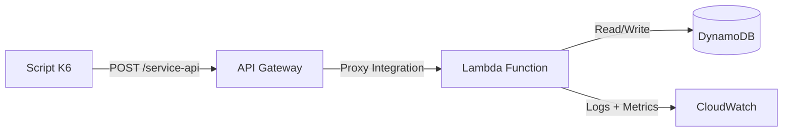
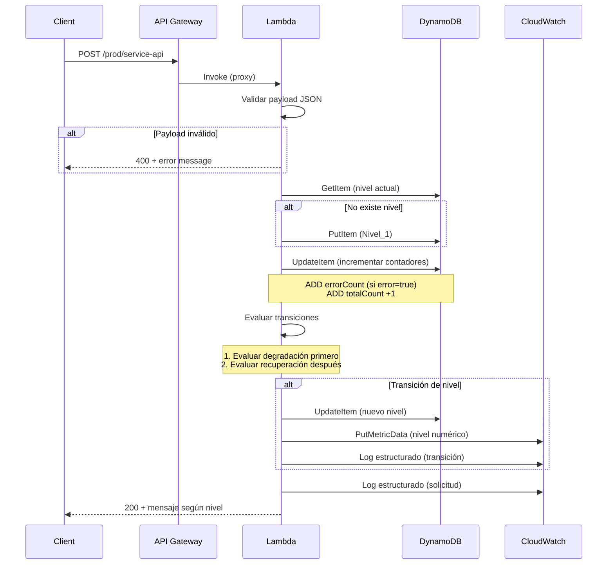

# Documento de Diseño: Niveles de Servicio Resilientes

## Visión General

Este diseño implementa un sistema de degradación progresiva y recuperación automática para Sistemas UltraSeguros S.A. La arquitectura es intencionalmente mínima: un único endpoint API Gateway que invoca una sola función Lambda, la cual gestiona todo el estado en una tabla DynamoDB y registra métricas en CloudWatch.

El flujo es lineal:
1. API Gateway recibe POST en `/service-api`
2. Lambda valida el payload
3. Lambda lee/actualiza el estado en DynamoDB (conteo de errores, nivel actual)
4. Lambda evalúa condiciones de transición (degradación tiene prioridad sobre recuperación)
5. Lambda responde con el mensaje apropiado según el nivel de servicio

### Decisiones de Diseño Clave

| Decisión | Justificación |
|----------|---------------|
| Una sola Lambda | Elimina complejidad de orquestación y cumple restricción de no Lambda-a-Lambda |
| Una sola tabla DynamoDB | Simplifica el modelo de datos; partition key por tipo de registro |
| Ventanas alineadas al minuto | Clave de ventana = timestamp truncado al minuto (e.g., `2024-01-15T10:05`) |
| Operaciones atómicas DynamoDB | `UpdateExpression` con `ADD` para incrementos atómicos sin race conditions |
| Sin colas ni eventos | El procesamiento es síncrono dentro de la invocación Lambda |
| Región us-east-2 | Requisito del proyecto, coincide con el script K6 |

## Arquitectura

### Diagrama de Componentes



### Flujo de Procesamiento por Solicitud



### Infraestructura (AWS SAM)

```yaml
# Recursos principales
Resources:
  ServiceApi:
    Type: AWS::Serverless::Api
    Properties:
      StageName: prod
      
  ServiceFunction:
    Type: AWS::Serverless::Function
    Properties:
      Runtime: nodejs20.x
      Timeout: 10
      MemorySize: 128
      
  StateTable:
    Type: AWS::DynamoDB::Table
    Properties:
      BillingMode: PAY_PER_REQUEST
```

## Componentes e Interfaces

### 1. API Gateway (ServiceApi)

- **Tipo**: REST API con integración proxy Lambda
- **Recurso**: `/service-api`
- **Método**: POST
- **Stage**: `prod`
- **Región**: us-east-2
- **Responsabilidad**: Enrutar solicitudes HTTP a la Lambda sin transformación

### 2. Lambda Function (ServiceFunction)

La función Lambda contiene toda la lógica de negocio organizada en módulos internos:

#### Módulos Internos

| Módulo | Responsabilidad |
|--------|----------------|
| `handler.js` | Entry point, orquesta el flujo |
| `validator.js` | Validación del payload JSON |
| `stateManager.js` | Lectura/escritura en DynamoDB |
| `levelEngine.js` | Lógica de transición de niveles |
| `logger.js` | Logging estructurado y métricas CloudWatch |

#### Interfaz del Handler

```javascript
// handler.js - Entry point
export async function handler(event) {
  // 1. Parsear y validar payload
  // 2. Leer estado actual de DynamoDB
  // 3. Actualizar contadores
  // 4. Evaluar transiciones (degradación > recuperación)
  // 5. Persistir cambios
  // 6. Registrar logs/métricas
  // 7. Retornar respuesta según nivel
  return { statusCode, body: JSON.stringify({ message, level }) };
}
```

#### Interfaz del Validador

```javascript
// validator.js
export function validatePayload(body) {
  // Retorna: { valid: true, data: { message, timestamp, error } }
  // O: { valid: false, error: "descripción del error" }
}
```

#### Interfaz del Motor de Niveles

```javascript
// levelEngine.js
export function evaluateTransition(currentLevel, errorCount, totalCount) {
  // Retorna: { newLevel, transitionType: 'degradation'|'recovery'|null }
}
```

#### Interfaz del Gestor de Estado

```javascript
// stateManager.js
export async function getCurrentLevel()
export async function setLevel(level)
export async function incrementCounters(windowKey, isError)
export async function getWindowCounters(windowKey)
export function getWindowKey(timestamp) // Trunca al minuto
```

### 3. DynamoDB (StateTable)

- **Tipo**: Tabla on-demand (PAY_PER_REQUEST)
- **Partition Key**: `pk` (String)
- **Sin Sort Key** (diseño más simple)

### 4. CloudWatch

- **Logs**: Automáticos de Lambda + logs estructurados JSON
- **Métricas personalizadas**: Namespace `ResilienceService`, métrica `ServiceLevel`

## Modelos de Datos

### Tabla DynamoDB: Diseño de Registros

La tabla usa un diseño de single-table con partition key `pk` para distinguir tipos de registro:

#### Registro de Nivel de Servicio

```json
{
  "pk": "SERVICE_LEVEL",
  "level": 1,
  "lastUpdated": "2024-01-15T10:05:30.000Z"
}
```

#### Registro de Ventana Temporal

```json
{
  "pk": "WINDOW#2024-01-15T10:05",
  "errorCount": 5,
  "totalCount": 12,
  "createdAt": "2024-01-15T10:05:00.000Z"
}
```

### Clave de Ventana Temporal

La clave se calcula truncando el timestamp al minuto:

```javascript
function getWindowKey(timestamp) {
  // Input: "2024-01-15T10:05:47.123Z"
  // Output: "WINDOW#2024-01-15T10:05"
  const date = new Date(timestamp);
  const truncated = date.toISOString().slice(0, 16); // "2024-01-15T10:05"
  return `WINDOW#${truncated}`;
}
```

### Operaciones DynamoDB

| Operación | Comando | Condición |
|-----------|---------|-----------|
| Leer nivel | `GetItem(pk="SERVICE_LEVEL")` | — |
| Inicializar nivel | `PutItem` con `ConditionExpression: attribute_not_exists(pk)` | Solo si no existe |
| Incrementar error | `UpdateItem` con `ADD errorCount :1, totalCount :1` | — |
| Incrementar total | `UpdateItem` con `ADD totalCount :1` | — |
| Cambiar nivel | `UpdateItem` con `SET level = :newLevel, lastUpdated = :ts` | — |

### Payload de Entrada (Request)

```json
{
  "message": "string (max 1024 chars)",
  "timestamp": "string (ISO 8601)",
  "error": true | false
}
```

### Payload de Salida (Response)

```json
{
  "message": "Nivel X: ...",
  "level": 1 | 2 | 3
}
```

### Logs Estructurados

#### Log de Solicitud

```json
{
  "type": "request",
  "level": 1,
  "error": false,
  "timestamp": "2024-01-15T10:05:30.000Z",
  "windowErrorCount": 3
}
```

#### Log de Transición

```json
{
  "type": "transition",
  "previousLevel": 1,
  "newLevel": 2,
  "transitionType": "degradation",
  "timestamp": "2024-01-15T10:05:30.000Z",
  "windowErrorCount": 5
}
```


## Propiedades de Correctitud

*Una propiedad es una característica o comportamiento que debe mantenerse verdadero en todas las ejecuciones válidas de un sistema — esencialmente, una declaración formal sobre lo que el sistema debe hacer. Las propiedades sirven como puente entre especificaciones legibles por humanos y garantías de correctitud verificables por máquinas.*

### Propiedad 1: Validación de payload acepta válidos y rechaza inválidos

*Para cualquier* payload JSON con campos `message` (string ≤1024 chars), `timestamp` (string ISO 8601) y `error` (boolean), la función de validación debe retornar válido. *Para cualquier* payload que no cumpla estas condiciones (campo faltante, tipo incorrecto, message >1024 chars, timestamp no ISO 8601), la función de validación debe retornar inválido con un mensaje de error descriptivo.

**Valida: Requisitos 1.2, 1.3, 1.4**

### Propiedad 2: Cálculo de clave de ventana temporal es truncamiento al minuto

*Para cualquier* timestamp válido en formato ISO 8601, la función `getWindowKey` debe producir una clave que corresponda al mismo timestamp con segundos y milisegundos eliminados. Dos timestamps que difieren solo en segundos/milisegundos dentro del mismo minuto deben producir la misma clave de ventana.

**Valida: Requisitos 2.2**

### Propiedad 3: Conteo correcto de errores y solicitudes totales

*Para cualquier* secuencia de solicitudes procesadas en una ventana temporal, el `errorCount` final debe ser igual al número de solicitudes con `error=true`, y el `totalCount` final debe ser igual al número total de solicitudes en la secuencia (independientemente del valor de `error`).

**Valida: Requisitos 2.1, 2.3, 2.4**

### Propiedad 4: Transición de degradación según umbrales

*Para cualquier* estado del sistema con un nivel actual y un conteo de errores en la ventana temporal, la función de evaluación de transición debe producir:
- Nivel_2 si nivel actual es Nivel_1 y errorCount ≥ 5 (y errorCount < 10)
- Nivel_3 si nivel actual es Nivel_2 y errorCount ≥ 10
- Nivel_3 si nivel actual es Nivel_1 y errorCount ≥ 10
- Sin cambio si no se alcanza ningún umbral

Además, después de una transición de degradación, el conteo de errores no debe reiniciarse.

**Valida: Requisitos 3.1, 3.2, 3.3, 3.5**

### Propiedad 5: Recuperación gradual de un solo nivel

*Para cualquier* estado del sistema donde el nivel actual es Nivel_2 o Nivel_3, si la ventana temporal actual tiene `errorCount = 0` y `totalCount ≥ 5`, la función de evaluación debe transicionar exactamente un nivel hacia arriba (Nivel_3→Nivel_2, Nivel_2→Nivel_1). Nunca debe saltar más de un nivel en una sola evaluación de recuperación.

**Valida: Requisitos 4.1, 4.2, 4.3**

### Propiedad 6: Degradación tiene prioridad sobre recuperación

*Para cualquier* estado del sistema donde simultáneamente se cumplen condiciones de degradación (errorCount alcanza umbral) y condiciones de recuperación, la función de evaluación debe aplicar la degradación y no la recuperación.

**Valida: Requisitos 4.4**

### Propiedad 7: Respuesta correcta según nivel de servicio

*Para cualquier* nivel de servicio válido (1, 2 o 3), la función de generación de respuesta debe producir un objeto con código HTTP 200, el mensaje de texto correspondiente al nivel, y un campo `level` con el valor numérico del nivel actual.

**Valida: Requisitos 5.1, 5.2, 5.3, 5.5**

## Manejo de Errores

### Errores de Validación (HTTP 400)

| Condición | Respuesta |
|-----------|-----------|
| Body no es JSON parseable | `{ "message": "El formato del body no es JSON válido", "level": null }` |
| Campo `message` ausente o no string | `{ "message": "Campo 'message' es inválido o está ausente", "level": null }` |
| Campo `message` excede 1024 caracteres | `{ "message": "Campo 'message' excede el máximo de 1024 caracteres", "level": null }` |
| Campo `timestamp` ausente o no ISO 8601 | `{ "message": "Campo 'timestamp' es inválido o está ausente", "level": null }` |
| Campo `error` ausente o no boolean | `{ "message": "Campo 'error' es inválido o está ausente", "level": null }` |

### Errores de Infraestructura

| Condición | Código HTTP | Respuesta |
|-----------|-------------|-----------|
| DynamoDB no disponible durante inicialización | 500 | `{ "message": "Servicio no disponible temporalmente", "level": null }` |
| DynamoDB falla en lectura/escritura en Nivel_3 | 503 | `{ "message": "Nivel 3: Sistema bajo mantenimiento, intente más tarde", "level": 3 }` |
| DynamoDB falla en lectura/escritura en Nivel_1 o Nivel_2 | 500 | `{ "message": "Error interno del servidor", "level": null }` |

### Estrategia de Reintentos

- **DynamoDB**: No se implementan reintentos a nivel de aplicación. El SDK de AWS ya incluye reintentos automáticos con backoff exponencial (3 intentos por defecto).
- **Timeout de Lambda**: 10 segundos, suficiente para operaciones DynamoDB (típicamente <50ms).

## Estrategia de Testing

### Tests Unitarios (example-based)

| Módulo | Tests |
|--------|-------|
| `validator.js` | Payloads válidos específicos, campos faltantes, tipos incorrectos, message vacío, message exactamente 1024 chars |
| `stateManager.js` | Inicialización cuando no existe estado, lectura/escritura con mocks de DynamoDB |
| `levelEngine.js` | Transiciones específicas en cada umbral exacto (4→5 errores, 9→10 errores) |
| `logger.js` | Formato correcto de logs de transición y solicitud |
| `handler.js` | Flujo completo con mocks, escenario del script K6 simplificado |

### Tests de Propiedades (property-based)

**Librería**: [fast-check](https://github.com/dubzzz/fast-check) (la librería PBT más madura para Node.js)

**Configuración**: Mínimo 100 iteraciones por propiedad.

| Propiedad | Módulo bajo test | Generadores |
|-----------|-----------------|-------------|
| Propiedad 1: Validación | `validator.js` | Payloads aleatorios válidos e inválidos (strings, números, booleans, objetos anidados) |
| Propiedad 2: Ventana temporal | `stateManager.getWindowKey` | Timestamps ISO 8601 aleatorios |
| Propiedad 3: Conteo | `stateManager` (con mock DDB) | Secuencias aleatorias de {error: true/false} |
| Propiedad 4: Degradación | `levelEngine.evaluateTransition` | Combinaciones de (nivel, errorCount, totalCount) |
| Propiedad 5: Recuperación | `levelEngine.evaluateTransition` | Estados con errorCount=0 y totalCount variable |
| Propiedad 6: Prioridad | `levelEngine.evaluateTransition` | Estados donde ambas condiciones se cumplen |
| Propiedad 7: Respuesta | Función de generación de respuesta | Niveles válidos (1, 2, 3) |

**Tag format**: `Feature: resilient-service-levels, Property {N}: {descripción}`

### Tests de Integración

- Desplegar stack completo en us-east-2
- Ejecutar script K6 (`reto3.js`) contra el endpoint real
- Verificar transiciones esperadas en cada minuto:
  - Minuto 1: Nivel_1 → Nivel_2 (5 errores)
  - Minuto 2: Nivel_2 → Nivel_1 (0 errores, 20 solicitudes)
  - Minuto 3: Nivel_1 → Nivel_2 → Nivel_3 (15 errores)
  - Minuto 4: Nivel_3 → Nivel_2 (0 errores, 20 solicitudes)
  - Minuto 5: Nivel_2 → Nivel_3 (15 errores)
  - Minuto 6: Nivel_3 → Nivel_2 (0 errores, 20 solicitudes)

### Tests de Smoke

- Verificar que el endpoint responde a POST
- Verificar que la tabla DynamoDB existe y es accesible
- Verificar que CloudWatch Logs está habilitado
