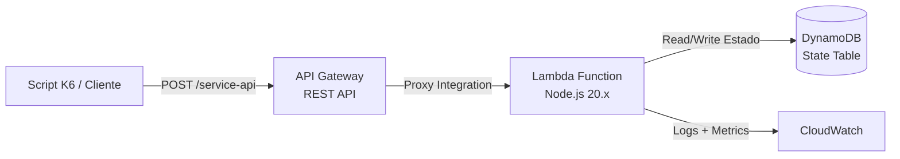
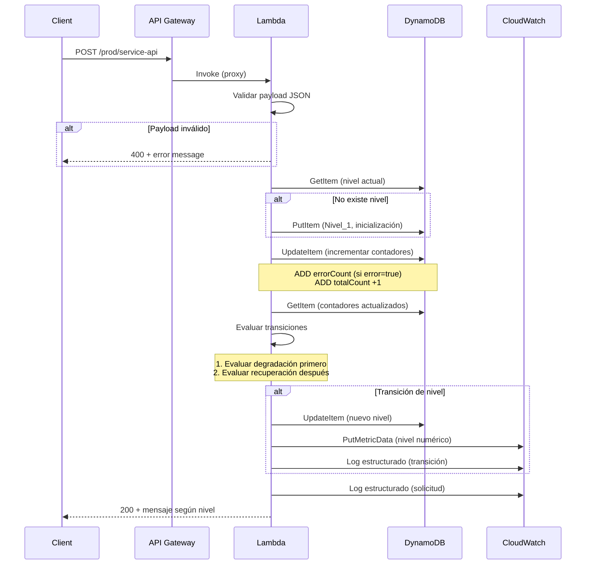
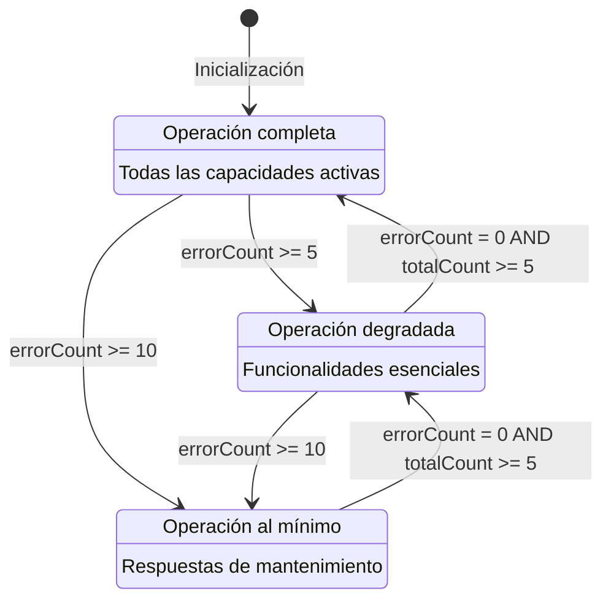

# Sistema de Niveles de Servicio Resilientes

## Descripción General

Sistema de **degradación progresiva y recuperación automática** para Sistemas UltraSeguros S.A. El sistema detecta errores en las solicitudes entrantes, ajusta dinámicamente el nivel de servicio (Completo → Degradado → Operación Mínima) y se recupera gradualmente cuando las condiciones de salud mejoran.

El principio fundamental es: **el sistema nunca se cae, solo reduce sus capacidades de forma controlada**.

---

## Tabla de Contenidos

1. [Decisiones de Arquitectura](#decisiones-de-arquitectura)
2. [Atributo de Calidad Priorizado](#atributo-de-calidad-priorizado)
3. [Diagrama de Arquitectura](#diagrama-de-arquitectura)
4. [Tácticas de Arquitectura](#tácticas-de-arquitectura)
5. [Cómo Funciona el Sistema](#cómo-funciona-el-sistema)
6. [Diseño Técnico Detallado](#diseño-técnico-detallado)
7. [Estructura del Proyecto](#estructura-del-proyecto)
8. [Despliegue](#despliegue)
9. [Testing](#testing)

---

## Decisiones de Arquitectura

### ¿Por qué una sola Lambda?

| Decisión | Justificación |
|----------|---------------|
| **Una sola Lambda** | La lógica es secuencial y autocontenida (validar → contar → evaluar → responder). Separar en múltiples funciones solo añadiría latencia, complejidad de orquestación y puntos de fallo sin beneficio alguno. Además, cumple la restricción de no usar invocaciones Lambda-a-Lambda. |
| **Una sola tabla DynamoDB** | Diseño single-table con partition key `pk` que distingue tipos de registro. Simplifica el modelo de datos y reduce costos operativos. |
| **Sin colas, eventos ni servicios intermediarios** | El procesamiento es síncrono dentro de la invocación Lambda. No hay necesidad de procesamiento asíncrono porque cada solicitud necesita una respuesta inmediata con el nivel actual. |
| **Ventanas temporales alineadas al minuto** | Permite agrupar errores en períodos discretos y predecibles. La clave de ventana se calcula truncando el timestamp al minuto. |
| **Operaciones atómicas en DynamoDB** | `UpdateExpression` con `ADD` para incrementos atómicos. Elimina race conditions sin necesidad de locks distribuidos. |
| **Región us-east-2** | Requisito del proyecto, coincide con el script K6 de pruebas. |

### ¿Por qué siempre responde HTTP 200?

El campo `error: true` en el payload **no es un error HTTP** — es una señal del cliente indicando que experimentó un problema. El sistema recibe esa señal correctamente, la contabiliza, y responde 200 porque:

- La solicitud fue procesada exitosamente
- El sistema está operando correctamente (en cualquiera de sus 3 niveles)
- La degradación no es un fallo, es una **decisión deliberada** de reducir capacidades

**Analogía**: Un semáforo en rojo no está "roto" — está operando en un modo diferente para proteger el sistema.

Los únicos casos donde NO responde 200:
- **400**: Payload inválido (JSON mal formado, campos faltantes)
- **500**: DynamoDB no disponible durante inicialización
- **503**: DynamoDB falla estando en Nivel 3 (sistema bajo mantenimiento)

---

## Atributo de Calidad Priorizado

### **Disponibilidad (Availability)**

La disponibilidad es el atributo de calidad más importante porque el objetivo central del sistema es **nunca dejar de responder**, incluso bajo condiciones adversas.

**¿Por qué se priorizó?**

1. **El sistema debe estar siempre accesible**: Incluso cuando detecta una alta tasa de errores, no se apaga — reduce sus capacidades de forma controlada.
2. **Degradación graceful sobre fallo total**: En lugar de devolver errores 500 cuando hay problemas, el sistema baja de nivel y sigue respondiendo con funcionalidad reducida.
3. **Recuperación automática sin intervención humana**: El sistema se auto-sana cuando las condiciones mejoran, eliminando la necesidad de intervención manual.
4. **Tolerancia a fallos de infraestructura**: Si DynamoDB falla, el sistema tiene respuestas de fallback según el nivel actual.

**Trade-offs aceptados:**
- Se sacrifica consistencia estricta (eventual consistency en los contadores) a favor de disponibilidad
- Se acepta simplicidad sobre flexibilidad (una sola Lambda, sin microservicios)
- Se prioriza tiempo de respuesta predecible sobre funcionalidad completa

---

## Diagrama de Arquitectura

### Vista de Componentes



### Flujo de Procesamiento por Solicitud



### Diagrama de Estados (Niveles de Servicio)



---

## Tácticas de Arquitectura

### 1. Degradación Progresiva (Graceful Degradation)

**Qué es**: Reducir las capacidades del sistema de forma escalonada en lugar de fallar completamente.

**Cómo se implementa**:
- El sistema tiene 3 niveles de servicio con umbrales definidos
- Nivel 1 → Nivel 2: cuando se acumulan 5+ errores en un minuto
- Nivel 1/2 → Nivel 3: cuando se acumulan 10+ errores en un minuto
- Cada nivel ofrece un subconjunto de funcionalidad, pero siempre responde

### 2. Detección de Fallos por Ventana Temporal

**Qué es**: Monitorear la tasa de errores en períodos discretos de tiempo para tomar decisiones.

**Cómo se implementa**:
- Cada solicitud con `error: true` incrementa un contador atómico en DynamoDB
- Los contadores se agrupan en ventanas de 1 minuto (alineadas al segundo 00)
- La clave de ventana se calcula truncando el timestamp: `WINDOW#2024-01-15T10:05`
- Esto permite evaluar la "salud" del sistema en períodos recientes y predecibles

### 3. Recuperación Automática (Self-Healing)

**Qué es**: El sistema se recupera sin intervención humana cuando las condiciones mejoran.

**Cómo se implementa**:
- Si una ventana temporal tiene 0 errores y al menos 5 solicitudes procesadas, el sistema sube un nivel
- La recuperación es **gradual**: solo sube un nivel por ventana saludable (Nivel 3 → 2 → 1)
- Esto evita oscilaciones rápidas entre niveles (flapping)

### 4. Prioridad de Degradación sobre Recuperación

**Qué es**: Ante condiciones ambiguas, el sistema prefiere protegerse (degradar) antes que exponerse (recuperar).

**Cómo se implementa**:
- En cada evaluación, primero se verifican condiciones de degradación
- Solo si no hay degradación, se evalúa la recuperación
- Esto garantiza que el sistema nunca "sube" cuando debería estar "bajando"

### 5. Operaciones Atómicas (Concurrency Control)

**Qué es**: Garantizar consistencia de los contadores bajo carga concurrente.

**Cómo se implementa**:
- DynamoDB `UpdateExpression` con `ADD` para incrementos atómicos
- `ConditionExpression: attribute_not_exists(pk)` para inicialización idempotente
- No se necesitan locks distribuidos ni transacciones

### 6. Observabilidad (Monitoring & Logging)

**Qué es**: Registrar todo lo necesario para auditar y diagnosticar el comportamiento del sistema.

**Cómo se implementa**:
- **Log de cada solicitud**: nivel actual, si fue error, timestamp, conteo de errores en la ventana
- **Log de cada transición**: nivel anterior, nivel nuevo, tipo (degradación/recuperación), conteo que la disparó
- **Métrica CloudWatch**: valor numérico del nivel (1, 2, 3) emitido en cada transición
- Todos los logs son JSON estructurado para facilitar queries en CloudWatch Insights

---

## Cómo Funciona el Sistema

### Detección de Fallos

El sistema no "detecta fallos" en el sentido tradicional (health checks, circuit breakers). En su lugar, **los clientes reportan sus propios errores** enviando `error: true` en el payload. El sistema contabiliza estos reportes por ventana temporal de 1 minuto.

```json
// El cliente reporta un error
{ "message": "timeout en servicio externo", "timestamp": "2024-01-15T10:05:30Z", "error": true }

// El cliente reporta operación exitosa
{ "message": "operación completada", "timestamp": "2024-01-15T10:05:33Z", "error": false }
```

### Degradación

Cuando los errores se acumulan en una ventana temporal:

| Condición | Transición | Significado |
|-----------|-----------|-------------|
| 5+ errores en el minuto actual | Nivel 1 → Nivel 2 | "Hay problemas, reducimos capacidades" |
| 10+ errores en el minuto actual | Nivel 2 → Nivel 3 | "Muchos problemas, operación mínima" |
| 10+ errores en el minuto actual | Nivel 1 → Nivel 3 | "Avalancha de errores, salto directo al mínimo" |

### Recuperación

Cuando los errores cesan:

| Condición | Transición | Significado |
|-----------|-----------|-------------|
| 0 errores + 5 solicitudes en el minuto | Nivel 3 → Nivel 2 | "Mejorando, subimos un nivel" |
| 0 errores + 5 solicitudes en el minuto | Nivel 2 → Nivel 1 | "Todo bien, operación completa" |

La recuperación requiere **evidencia positiva** (al menos 5 solicitudes sin error), no solo ausencia de errores. Esto evita que el sistema se recupere prematuramente en períodos de baja actividad.

### Respuestas por Nivel

| Nivel | HTTP | Mensaje |
|-------|------|---------|
| 1 | 200 | "Nivel 1: Operación completa, todas las capacidades activas" |
| 2 | 200 | "Nivel 2: Operación degradada, funcionalidades esenciales disponibles" |
| 3 | 200 | "Nivel 3: Operación al mínimo" |

### Logs y Métricas

**Log de solicitud** (cada request):
```json
{ "type": "request", "level": 1, "error": false, "timestamp": "2024-01-15T10:05:30.000Z", "windowErrorCount": 3 }
```

**Log de transición** (solo cuando cambia de nivel):
```json
{ "type": "transition", "previousLevel": 1, "newLevel": 2, "transitionType": "degradation", "timestamp": "2024-01-15T10:05:30.000Z", "windowErrorCount": 5 }
```

**Métrica CloudWatch**: Se emite `PutMetricData` con namespace `ResilienceService`, métrica `ServiceLevel`, valor numérico (1, 2 o 3) cada vez que hay una transición.

---

## Diseño Técnico Detallado

### Módulos Internos de la Lambda

| Módulo | Responsabilidad |
|--------|----------------|
| `handler.js` | Entry point. Orquesta el flujo completo de cada solicitud |
| `validator.js` | Valida el payload JSON (message, timestamp, error) |
| `stateManager.js` | Lee/escribe estado en DynamoDB (nivel, contadores) |
| `levelEngine.js` | Evalúa condiciones de transición (degradación y recuperación) |
| `logger.js` | Logging estructurado JSON y emisión de métricas CloudWatch |

### Modelo de Datos (DynamoDB Single-Table)

```
┌─────────────────────────────────────────────────────────┐
│ pk (Partition Key)        │ Atributos                    │
├───────────────────────────┼──────────────────────────────┤
│ SERVICE_LEVEL             │ level: 1, lastUpdated: ISO   │
│ WINDOW#2024-01-15T10:05   │ errorCount: 5, totalCount: 12│
│ WINDOW#2024-01-15T10:06   │ errorCount: 0, totalCount: 20│
└─────────────────────────────────────────────────────────┘
```

### Operaciones DynamoDB

| Operación | Comando | Propósito |
|-----------|---------|-----------|
| Leer nivel | `GetItem(pk="SERVICE_LEVEL")` | Obtener nivel actual |
| Inicializar | `PutItem` + `attribute_not_exists(pk)` | Crear nivel 1 si no existe |
| Incrementar error | `ADD errorCount :1, totalCount :1` | Conteo atómico de error |
| Incrementar total | `ADD totalCount :1` | Conteo atómico de solicitud normal |
| Cambiar nivel | `SET level = :new, lastUpdated = :ts` | Persistir transición |

### Manejo de Errores de Infraestructura

| Escenario | Código | Respuesta |
|-----------|--------|-----------|
| DynamoDB falla en inicialización | 500 | "Servicio no disponible temporalmente" |
| DynamoDB falla en Nivel 3 | 503 | "Nivel 3: Sistema bajo mantenimiento, intente más tarde" |
| DynamoDB falla en Nivel 1 o 2 | 500 | "Error interno del servidor" |

---

## Estructura del Proyecto

```
doplimado-arquitectura-reto-3/
├── src/                          # Código fuente de la Lambda
│   ├── handler.js                # Entry point (orquestador)
│   ├── validator.js              # Validación de payload
│   ├── stateManager.js           # Acceso a DynamoDB
│   ├── levelEngine.js            # Motor de transiciones
│   ├── logger.js                 # Logging y métricas
│   └── package.json              # ES modules marker
├── tests/
│   ├── unit/                     # Tests unitarios (79 tests)
│   │   ├── handler.test.js
│   │   ├── validator.test.js
│   │   ├── stateManager.test.js
│   │   ├── levelEngine.test.js
│   │   └── logger.test.js
│   └── property/                 # Tests de propiedad (21 tests)
│       ├── validator.property.test.js
│       ├── stateManager.property.test.js
│       ├── levelEngine.property.test.js
│       └── handler.property.test.js
├── terraform/                    # Infraestructura como código
│   ├── main.tf                   # Recursos AWS
│   ├── variables.tf              # Variables configurables
│   └── outputs.tf                # Outputs (URL del API, etc.)
├── reto3.js                      # Script K6 de pruebas de carga
├── template.yaml                 # SAM template (referencia)
├── package.json                  # Dependencias del proyecto
├── vitest.config.js              # Configuración de tests
└── README.md                     # Este archivo
```

---

## Despliegue

### Prerrequisitos

- AWS CLI configurado con credenciales
- Terraform >= 1.0
- Node.js 20.x (para tests locales)

### Comandos

```bash
# 1. Inicializar Terraform
terraform -chdir=terraform init

# 2. Ver plan de ejecución
AWS_PROFILE=personal terraform -chdir=terraform plan

# 3. Desplegar
AWS_PROFILE=personal terraform -chdir=terraform apply

# 4. Obtener URL del endpoint
AWS_PROFILE=personal terraform -chdir=terraform output api_url

# 5. Probar manualmente
curl -X POST <URL> -H "Content-Type: application/json" \
  -d '{"message":"test","timestamp":"2024-01-15T10:05:30Z","error":false}'

# 6. Destruir recursos (cuando termines)
AWS_PROFILE=personal terraform -chdir=terraform destroy
```

---

## Testing

### Tests Locales (100 tests)

```bash
# Ejecutar todos los tests
npm test

# Solo tests unitarios
npm run test:unit

# Solo tests de propiedad
npm run test:property
```

### Tests de Integración (K6)

```bash
# Instalar K6
brew install k6

# Ejecutar prueba de carga (7 minutos)
k6 run reto3.js

# Con logs guardados localmente
k6 run reto3.js 2>&1 | tee k6-results.log
```

### Escenario de Prueba K6

| Minuto | Errores | Solicitudes Totales | Transición Esperada |
|--------|---------|--------------------|--------------------|
| 1 | 5 de 20 | 20 | Nivel 1 → Nivel 2 |
| 2 | 0 de 20 | 20 | Nivel 2 → Nivel 1 (recuperación) |
| 3 | 15 de 20 | 20 | Nivel 1 → Nivel 2 → Nivel 3 |
| 4 | 0 de 20 | 20 | Nivel 3 → Nivel 2 (recuperación) |
| 5 | 15 de 20 | 20 | Nivel 2 → Nivel 3 |
| 6 | 0 de 20 | 20 | Nivel 3 → Nivel 2 (recuperación) |

---

## Propiedades de Correctitud

El sistema se valida mediante **Property-Based Testing** (PBT) con `fast-check`. Cada propiedad es una declaración formal que debe mantenerse verdadera para todas las entradas posibles:

| # | Propiedad | Qué Garantiza |
|---|-----------|---------------|
| 1 | Validación acepta válidos y rechaza inválidos | Payloads correctos pasan, incorrectos se rechazan con mensaje claro |
| 2 | Clave de ventana es truncamiento al minuto | Dos timestamps en el mismo minuto producen la misma clave |
| 3 | Conteo correcto de errores y totales | errorCount = solicitudes con error=true, totalCount = todas |
| 4 | Degradación según umbrales | Las transiciones ocurren exactamente en los umbrales definidos |
| 5 | Recuperación gradual de un solo nivel | Nunca salta más de un nivel hacia arriba |
| 6 | Degradación tiene prioridad sobre recuperación | Ante ambigüedad, el sistema se protege |
| 7 | Respuesta correcta según nivel | Cada nivel produce el mensaje y código HTTP correcto |
